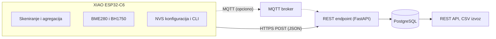

# Guzvomator – IoT sistem za procenu zauzetosti prostora

Studija slučaja i predlog seminara

## 1 Osnovna ideja projekta

Cilj projekta je razvoj prototipa IoT sistema koji procenjuje trenutnu zauzetost prostora pasivnim osluškivanjem Bluetooth Low Energy (BLE) signala pomoću ESP32 uređaja.

Savremeni mobilni telefoni i drugi elektronski uređaji periodično emituju BLE advertising pakete koje ESP32 može da detektuje bez povezivanja sa samim uređajem. Broj detektovanih uređaja u kratkom vremenskom intervalu koristi se kao indikator (proxy) broja ljudi u prostoru.

Cilj sistema nije praćenje pojedinačnih uređaja, već agregirana procena zauzetosti. Za slučaj upotrebe i testiranje odabrana je studentska čitaonica na fakultetu: studenti bi pre dolaska mogli da provere približnu zauzetost i procene da li ima slobodnih mesta.

Projekat radi jedan student, Miša Stefanović (209/22).

## 2 Problem i motivacija

Studenti nemaju jednostavan način da saznaju koliko je neki zajednički prostor trenutno zauzet, pa je potrebno fizički otići do njega da bi se procenilo da li je gužva. Isti problem postoji kod menze, čitaonica, biblioteka, laboratorija i drugih zajedničkih prostorija.

Komercijalni sistemi za praćenje zauzetosti postoje (na primer Occuspace i Cisco Spaces), ali su namenjeni velikim organizacijama i zasnovani na zatvorenim platformama, namenskom hardveru ili cloud servisima.

Projekat ispituje mogućnost razvoja sistema koji je:

- jeftin i zasnovan na ESP32 uređajima;
- open-source i self-hosted;
- bez instalacije aplikacije na telefonima korisnika;
- API-first, radi integracije sa drugim servisima;
- jednostavan za podešavanje: konfiguracija se trajno čuva na uređaju i menja se bez ponovnog flešovanja firmvera, a backend se pokreće jednom komandom.

Projekat je inspirisan eksperimentom Occumetrics [1, 2], u kome je ESP32 korišćen za pasivno BLE skeniranje i procenu promena zauzetosti. Slična rešenja su open-source projekti ESP32-Paxcounter [4] i ESPresense [8]. Rezultati pokazuju da broj detektovanih uređaja može poslužiti kao indikator zauzetosti, ali da njegov odnos prema stvarnom broju ljudi zavisi od konkretnog prostora, zbog čega je potrebna kalibracija.

## 3 Istraživačko pitanje

U kojoj meri broj BLE uređaja detektovanih pomoću jeftinog ESP32 senzorskog čvora može da posluži kao koristan indikator stvarne zauzetosti studentske čitaonice?

Broj detektovanih uređaja nije jednak broju ljudi: jedna osoba može imati više uređaja, neki uređaji ostaju nedetektovani, a ponašanje BLE emitovanja zavisi od proizvođača i operativnog sistema. Zato se procena kalibriše i validira poređenjem sa nezavisnim brojanjem ljudi u prostoru, kako je opisano u odeljku 6.

## 4 Predložena arhitektura sistema

Sistem se sastoji od senzorskog čvora, dva izmenljiva načina slanja i backend-a koji prima i čuva agregirane zapise.

ESP32 uređaj periodično skenira BLE, lokalno obrađuje rezultate i šalje samo agregirane podatke. Jedan zapis sadrži:

- identifikator senzorskog čvora i vreme merenja (UTC, sa sata sinhronizovanog preko NTP-a);
- broj detektovanih uređaja i broj uređaja čiji RSSI prelazi definisani prag;
- prosečan RSSI i trajanje perioda skeniranja;
- temperaturu, vlažnost vazduha i osvetljenost.

Backend prima isti zapis sa oba transporta, a MQTT broker i MQTT transport su opcioni.

## 5 Hardver i firmware

Senzorski čvor je Seeed Studio XIAO ESP32-C6 [3]. Ploča ima integrisan BLE i Wi-Fi, nisku potrošnju u režimu dubokog sna i ugrađeno punjenje Li-ion baterije. Firmver se razvija u PlatformIO okruženju sa Arduino framework-om.

**Hardver**

- XIAO ESP32-C6 kao senzorski čvor, USB napajanje; uređaj je stalno uključen;
- BME280 (temperatura i vlažnost vazduha) i BH1750 (osvetljenost) preko I2C, kao ambijentalni kontekst uz procenu zauzetosti;
- Wi-Fi konekcija za slanje podataka, uz do tri sačuvana profila mreže (SSID i lozinka, WPA2-Personal); uređaj se povezuje na najjaču vidljivu poznatu mrežu.

**Ciklus firmvera**

Uređaj radi stalno, bez dubokog sna. Firmver koristi dva FreeRTOS taska: task komandne linije (čita serijski port i menja konfiguraciju) i radni task koji stalno ponavlja sledeći ciklus. Konfiguracija se deli preko muteksa, a radni task je na početku svakog ciklusa preuzima, pa se izmena primenjuje u sledećem ciklusu.

1. Učitavanje konfiguracije iz trajne memorije (NVS) pri pokretanju; na početku svakog ciklusa provera da je Wi-Fi povezan na jedan od sačuvanih profila, počevši od najjačeg vidljivog (ponovni pokušaji bez blokiranja komandne linije); merenje počinje tek posle prve sinhronizacije sata preko NTP-a.
2. BLE skeniranje u prozoru zadatog trajanja. Wi-Fi ostaje povezan tokom skeniranja. ESP32-C6 ima jedan 2,4 GHz radio koji BLE i Wi-Fi dele vremenskom podelom (koegzistencija), pa prenos može da utiče na broj uhvaćenih paketa. Ovo treba proveriti u praksi poređenjem broja detektovanih uređaja sa Wi-Fi saobraćajem i bez njega. Wi-Fi probe zahtevi su eventualni dodatni izvor.
3. Heširanje adresa uređaja novom nasumičnom solju generisanom za taj prozor, brojanje jedinstvenih heševa, RSSI filtriranje, odbacivanje sirovih adresa iz RAM-a.
4. Očitavanje BME280 i BH1750.
5. Slanje agregiranog zapisa preko odabranog transporta. Ako slanje ne uspe, ograničen broj poslednjih zapisa čuva se u RAM-u i šalje po ponovnom povezivanju, svaki sa svojim vremenom merenja.
6. Kratka pauza do sledećeg ciklusa.

Čvor sinhronizuje sat preko NTP-a i koristi ga za proveru datuma važenja TLS sertifikata pri HTTPS komunikaciji i za vremenske oznake zapisa (UTC). Sat nastavlja da radi i kada Wi-Fi privremeno nestane, a ponovo se sinhronizuje po povratku mreže. Backend dodatno čuva sopstveno vreme prijema zapisa, radi dijagnostike. Jedinstveni ključ zapisa je kombinacija identifikatora čvora i vremena merenja, pa je ponovno slanje istog zapisa bezbedno.

**Konfiguracija i komandna linija**

Parametri (identifikator uređaja, do tri Wi-Fi profila, tip transporta i adresa, NTP server, trajanje prozora skeniranja, interval, RSSI prag) registruju se kao konfiguracioni parametri po uzoru na dizajn biblioteke arduinoConfig [6] i trajno čuvaju u NVS-u. Autor je biblioteku arduinoConfig označio kao zastarelu, pa se ona ne koristi kao zavisnost, već se implementira sopstveni registar parametara sa istim konceptom (naziv, tip, promenljiva i povratni poziv pri izmeni); trajno čuvanje je deo sopstvene implementacije. Podešavanje se vrši preko serijske komandne linije zasnovane na arduinoCmdProc [7] (komande poput `list`, `get`, `set`, `save`, `reset`, `status`). Tačan skup komandi biće usklađen sa bibliotekom arduinoCmdProc. Web portal za konfiguraciju nije deo osnovnog obima.

**Opciona proširenja**

Baterijsko napajanje i režimi niske potrošnje, uz analizu uticaja na učestalost merenja i autonomiju. Zigbee mesh nije deo ovog rada.

## 6 Validacija i prikupljanje podataka

Za validaciju se paralelno posmatraju dva izvora podataka vezana za iste vremenske intervale: BLE merenje senzorskog čvora i nezavisno utvrđen broj ljudi u prostoru.

**Ground truth.** Osnovni metod je ručno brojanje u unapred određenim terminima, usklađeno sa prozorima skeniranja. Evidencija postojećeg sistema ulaska u čitaonicu ne može se koristiti: proverom je utvrđeno da ne postoji digitalno beleženje, jer portir ručno menja fizičke kartice za studentske indekse. Kao opcioni cilj, ukoliko fakultet dozvoli postavljanje senzora na ulaz, razmatra se VL53L1X ToF senzor za usmereno brojanje ulazaka i izlazaka.

Primer oblika podataka (linearnost je samo ilustracija, u realnosti odnos ne mora biti linearan):

| Vreme | BLE uređaji | Realan broj osoba |
| --- | --- | --- |
| 10:00 | 31 | 22 |
| 10:01 | 34 | 23 |
| 10:02 | 37 | 25 |

**Analiza.** Na osnovu podataka ispituju se:

- odnos između broja detektovanih BLE uređaja i stvarne zauzetosti;
- odstupanje procene od stvarne zauzetosti;
- uticaj RSSI praga na rezultate;
- ponašanje sistema pri različitim nivoima zauzetosti;
- stabilnost merenja tokom vremena;
- pozadinski broj uređaja iz susednih prostorija i spratova, izmeren pri praznom prostoru.

Broj detektovanih uređaja nije uporediv između prostora, pa se RSSI prag i kalibracija određuju za svaki prostor posebno. RSSI ne razlikuje pravac, pa uređaji iz susednih prostorija i sa drugih spratova ulaze u slabiji deo opsega; zato se za svaki prostor beleži merenje pri praznoj prostoriji kao referenca. Za velike prostorije jedan čvor pokriva samo zonu oko sebe. Varijacija broja uređaja pri istom broju osoba (smena posetilaca, ponašanje telefona, rotacija adresa) navodi se u analizi.

Način kalibracije (na primer regresija nad prikupljenim podacima) određuje se tek nakon analize odnosa koji se u podacima pokaže. Kalibracija važi za konkretan prostor.

## 7 Privatnost i ograničenja

Obrada identifikatora uređaja vrši se lokalno na ESP32 čvoru. Adrese se heširaju nasumičnom solju koja se generiše iznova za svaki prozor skeniranja (strože od dnevne promene); so se ne čuva niti šalje, a heševi se čuvaju samo u RAM-u tokom prozora skeniranja i odbacuju zajedno sa solju posle brojanja. Centralnom sistemu se šalju samo agregirani podaci, bez adresa ili drugih podataka koji bi omogućili dugoročno praćenje pojedinačnih uređaja. Kamere se ne koriste.

Pre postavljanja sistema u stvaran prostor potrebna je dozvola fakulteta za postavljanje senzora, uz proveru dodatnih zahteva u vezi sa privatnošću.

**MAC randomizacija** je poznato osnovno ograničenje metode. Noviji telefoni menjaju adresu koju emituju, pa jedan uređaj može biti izbrojan više puta u dužem prozoru, a broj jedinstvenih adresa se ne poklapa sa brojem uređaja. Zato se kratki prozori skeniranja, RSSI prag i kalibracija prema ground truth podacima razmatraju u metodologiji rada, a ograničenje se navodi eksplicitno pri tumačenju rezultata.

## 8 Odabrani tech stack

| Komponenta | Tehnologija |
| --- | --- |
| Edge uređaj | Seeed Studio XIAO ESP32-C6, PlatformIO, Arduino framework |
| Senzori | BLE skeniranje (Wi-Fi opciono), BME280, BH1750 |
| Konfiguracija | sopstveni registar parametara po uzoru na arduinoConfig, trajno čuvanje u NVS-u, serijska komandna linija (arduinoCmdProc) |
| Transport | HTTPS POST (JSON) ili MQTT, biranje u konfiguraciji |
| MQTT broker | Eclipse Mosquitto (opciono) |
| Backend | REST endpoint, FastAPI (self-hosted); ista logika prenosiva u Azure Function |
| Baza podataka | PostgreSQL |
| Pristup podacima | REST API, izvoz u CSV/JSON za analizu |
| Deployment | Docker Compose na sopstvenom serveru ili VPS-u; Azure Functions kao alternativa |

Uređaj šalje isti JSON zapis bez obzira na transport, pa backend ne zavisi od izabranog načina slanja. Web dashboard nije deo obima ovog rada; podaci su dostupni preko REST API-ja i mogu se prikazati bilo kojim klijentom.

Sistem može da radi kao samostalna self-hosted instanca ili uz Azure servise, bez vezivanja osnovne funkcionalnosti za konkretnog cloud vendor-a.

## 9 Plan rada i obim

Projekat radi jedan student, pa je obim sveden na ono što je potrebno da se odgovori na istraživačko pitanje. Redosled rada:

1. Firmver: BLE skeniranje, prozori, heširanje, filtriranje i lokalna agregacija.
2. Konfiguracija i komandna linija (arduinoConfig, arduinoCmdProc) sa trajnim čuvanjem u NVS-u.
3. HTTP transport i backend: REST endpoint, PostgreSQL, Docker Compose.
4. Očitavanje BME280 i BH1750 i njihovo dodavanje u zapis.
5. MQTT transport preko istog interfejsa (prvi kandidat za izbacivanje ako vremena ponestane).
6. Prikupljanje podataka u čitaonici uz ručno brojanje, kalibracija i analiza.
7. Pisanje seminarskog rada.

**Opciono, ako vreme dozvoli:** ToF senzor na ulazu kao ground truth, Wi-Fi probe skeniranje, baterijsko napajanje i duboki san, web portal za konfiguraciju, predviđanje buduće zauzetosti alatom NeuralProphet [5].

Rokovi nisu navedeni; dodati ih kada se potvrdi rok za predaju.

## 10 Očekivani rezultat

Rezultat je funkcionalan proof-of-concept IoT sistem koji omogućava:

- automatsko prikupljanje i lokalnu agregaciju podataka o detektovanim BLE uređajima, uz ambijentalna merenja;
- konfigurisanje uređaja preko komandne linije uz trajno čuvanje podešavanja;
- prenos podataka do centralnog sistema preko HTTP-a (i MQTT-a, ukoliko vreme dozvoli);
- skladištenje podataka i pristup njima preko REST API-ja;
- procenu zauzetosti na osnovu prikupljenih podataka;
- pokretanje backend-a jednom komandom u self-hosted okruženju;
- kalibraciju i evaluaciju BLE procene u odnosu na ručno brojanje u čitaonici.

## Reference

1. Matthew McCormick. Building an occupancy sensor with a $5 ESP32 and a serverless DB. [matthew.science/posts/occupancy](https://matthew.science/posts/occupancy/)
2. Hacker News discussion: Building an occupancy sensor with a $5 ESP32 and a serverless DB. [news.ycombinator.com/item?id=38252566](https://news.ycombinator.com/item?id=38252566)
3. Seeed Studio. Getting Started with Seeed Studio XIAO ESP32-C6. [wiki.seeedstudio.com](https://wiki.seeedstudio.com/xiao_esp32c6_getting_started/)
4. ESP32-Paxcounter. Open-source ESP32 Wi-Fi/BLE people counter. [github.com/cyberman54/ESP32-Paxcounter](https://github.com/cyberman54/ESP32-Paxcounter)
5. NeuralProphet Documentation. [neuralprophet.com](https://neuralprophet.com/contents.html)
6. arduinoConfig, biblioteka za runtime konfiguraciju. [github.com/djherceg/arduinoConfig](https://github.com/djherceg/arduinoConfig)
7. arduinoCmdProc, komandni procesor. [github.com/djherceg/arduinoCmdProc](https://github.com/djherceg/arduinoCmdProc)
8. ESPresense. [github.com/ESPresense/ESPresense](https://github.com/ESPresense/ESPresense)